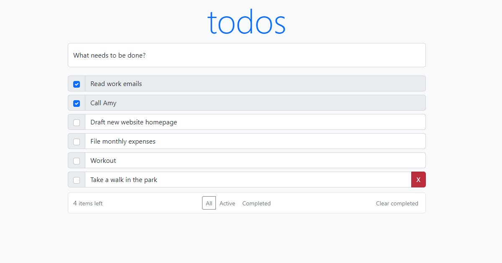

# React  App

### CI, tests:

## Sobre
✅Aplicativo React Todo construído com React (com ganchos), Redux (@redux/toolkit) com layout adaptativo usando Bootstrap + Formik + testes Playwright + Docker

## Começando
- Clonar um repositório
- Vá para o diretório de trabalho do projeto `cd playwright-ts-redux-toolkit`
- Execute `make app-setup`
- Execute testes `make app-test`
- Iniciar o servidor `make up`

## Características
- Adicionar, editar, excluir e marcar tarefas concluídas
- Filtrar tarefas por Todos, Ativos, Concluídos
- Limpe todas as tarefas concluídas com um clique
- Exibindo o contador de tarefas restantes

## Demonstração
Confira o projeto de demonstração para um exemplo rápido de como o aplicativo React Todo funciona.

# kit de ferramentas redux

By: Void
